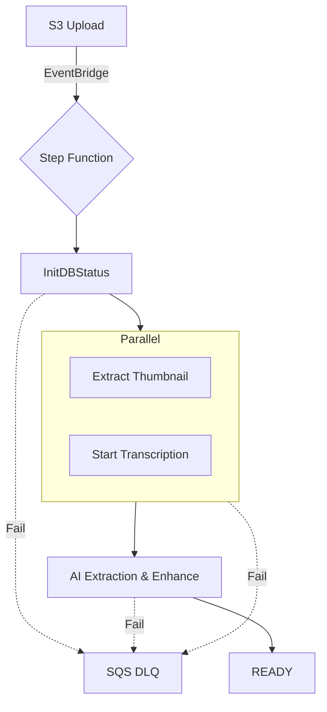

# 🎬 Video Upload & Processing Workflow

## 📋 Overview

Complete video upload workflow with compression, S3 storage, caption generation, and AI-powered content creation.

## 🔄 Workflow Steps

### 1. Course Creation
- **Endpoint**: `POST /api/courses`
- **Storage**: DynamoDB (`video-course-courses-dev` table)
- **Data**: Course metadata (name, title, description, category)

### 2. Video Upload & Processing
- **Endpoint**: `POST /api/courses/upload-video`
- **Process**:
  1. **Upload**: Receive video file via multer
  2. **Compress**: FFmpeg compression (fallback to original if unavailable)
  3. **S3 Upload**: Store compressed video in S3 bucket
  4. **Captions**: Generate .srt captions (placeholder or real speech-to-text)
  5. **AI Content**: Generate quiz, summary, and todo list
  6. **Database**: Save video metadata to DynamoDB

### 3. Caption Generation
- **Local Machine**: Uses FFmpeg for audio extraction + speech-to-text
- **EC2 Instance**: Downloads from S3, processes, uploads .srt back to S3
- **Storage**: S3 bucket with .srt files
- **Serving**: Direct S3 URLs for caption access

### 4. AI Content Generation
- **Service**: Google Gemini AI (configurable)
- **Content Types**:
  - **Quiz**: Multiple choice questions with explanations
  - **Summary**: Key points and takeaways
  - **Todo List**: Actionable tasks for viewers
- **Storage**: Embedded in video metadata in DynamoDB

## 🏗️ Architecture (Pillar 2: Step Functions)

The pipeline uses **AWS Step Functions** for industrial-grade orchestration. 



## 📁 File Structure

```
backend/src/
├── services/
│   ├── videoProcessingService.js  # Main processing logic
│   ├── aiService.js              # AI content generation
│   └── dynamoVideoService.js     # Database operations
├── controllers/
│   ├── courseController.js       # Course & video endpoints
│   └── webController.js          # Admin UI rendering
└── utils/
    └── dynamodb.js              # DynamoDB client & operations
```

## 🔧 Configuration

### Environment Variables
```bash
# AWS Configuration
AWS_REGION=us-east-1
AWS_ACCESS_KEY_ID=your-access-key
AWS_SECRET_ACCESS_KEY=your-secret-key
S3_BUCKET_NAME=your-video-bucket

# AI Services
GEMINI_API_KEY=your-gemini-key

# Database
NODE_ENV=development  # Creates *-dev tables
```

### DynamoDB Tables
- `video-course-courses-dev` - Course metadata
- `video-course-videos-dev` - Video metadata with AI content
- `video-course-gamification-dev` - User progress
- `video-course-users-dev` - User data

## 🚀 Usage

### 1. Access Admin Interface
```
GET /admin/courses
```

### 2. Create Course
```javascript
POST /api/courses
{
  "name": "aws-fundamentals",
  "title": "AWS Fundamentals",
  "description": "Learn AWS basics",
  "category": "Cloud Computing"
}
```

### 3. Upload Video
```javascript
POST /api/courses/upload-video
Content-Type: multipart/form-data

courseName: "aws-fundamentals"
title: "Introduction to EC2"
video: [video file]
```

### 4. Response Format
```javascript
{
  "success": true,
  "data": {
    "_id": "1703123456789",
    "courseName": "aws-fundamentals",
    "title": "Introduction to EC2",
    "videoUrl": "https://bucket.s3.region.amazonaws.com/videos/...",
    "captionsUrl": "https://bucket.s3.region.amazonaws.com/captions/...",
    "quiz": {
      "questions": [...]
    },
    "summary": "This video covers...",
    "todoList": {
      "tasks": [...]
    }
  }
}
```

## 🎯 Features

### ✅ Implemented
- **Course Creation**: DynamoDB storage with metadata
- **Video Upload**: Multer file handling
- **Video Compression**: FFmpeg with graceful fallback
- **S3 Integration**: Secure video and caption storage
- **Caption Generation**: Placeholder SRT with S3 upload
- **AI Content**: Quiz, summary, todo generation via Gemini
- **Admin Interface**: Apple-designed UI for management
- **Error Handling**: Graceful degradation for missing services

### 🔄 Environment Detection
- **Local Machine**: Direct FFmpeg processing
- **EC2 Instance**: S3 download → process → upload workflow
- **Fallback**: Works without FFmpeg or AI services

### 🛡️ Error Handling (Pillar 3: DLQs)
- **Circuit Breaker**: Failed videos are routed to an **SQS Dead Letter Queue** for manual replay.
- **AI Self-Correction**: Zod validation failure triggers an automated LLM retry with error context.
- **Stale Sync**: A weekly audit job purges DynamoDB records with missing S3 assets.

## 📊 Monitoring

### Health Checks
```javascript
GET /health
// Returns status of all services
```

### Logs
- Video processing progress
- S3 upload status
- AI generation results
- Error tracking with context

## 🔐 Security

### Access Control
- Admin interface requires authentication
- S3 bucket permissions for video access
- API endpoints with proper validation

### Data Protection
- Secure S3 URLs with expiration
- Environment variable configuration
- No hardcoded credentials

## 🚀 Deployment

### Local Development
```bash
cd backend
npm install
npm run dev
```

### Production
- Environment variables configured
- S3 bucket created and accessible
- DynamoDB tables auto-created
- FFmpeg installed on processing servers

---

**The video upload workflow is now fully implemented with compression, S3 storage, caption generation, and AI-powered content creation!**